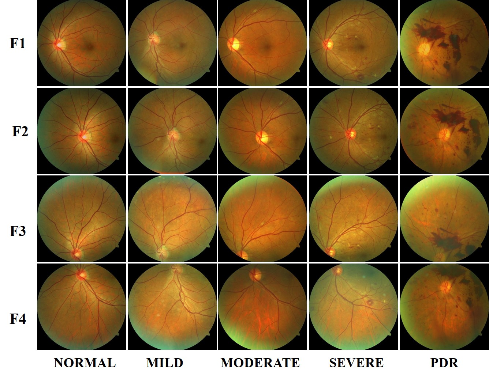

# MFIDDR
A Large-Scale Multi-Field Imaging Dataset for Diabetic Retinopathy Screening
## Abstract
Diabetic retinopathy (DR) is a major cause of irreversible visual impairment and blindness worldwide. In recent years, deep learning based approaches have been used to detect and grade DR. Early detection enables appropriate treatment and thus prevents vision loss. To evaluate the performance of any such deep learning method, a large-scale database of retinal images needs to be established as a reference for benchmarking the performance of the developed method. Unlike previous studies, to further promote the early diagnosis precision and robustness in practice, we provide the four-field fundus images from the same eyes, e.g. the image centered on the macula, the image centered on the optic disc, and the images tangent to the upper and lower horizontal lines of the optic disc respectively, to classify and grade DR lesions. Our database, MFIDDR (Multi-Field Imaging Database for Diabetic Retinopathy Screening), provides 4,344-patient data including 34,452 images in total, with the annotation information that contains the DR grade label and the patient's age. The images were taken using the Zeiss VISUCAM NM/FA fundus camera with a resolution of 2,124 × 2,056 pixels in JPEG format.

<div align="center">

</br>
<strong>Figure1</strong>: Samples in five DR stages (i.e. normal, mild NPDR, moderate NPDR, severe NPDR and PDR) of our MFIDDR database. F1: the images centered on the macula, F2: the images centered on the optic disc, F3: the images above the horizontal line on the optic disc, F4: the images below the horizontal line on the optic disc.
</div>


For a sample of MFIDDR, clone this repository with `git clone https://github.com/mfiddr/MFIDDR.git`.

## File Structure
```
$ tree MFIDDR
MFIDDR
├── train
│   ├── 1_79371678_right_01.jpg
│   ├── 1_79371678_right_02.jpg
│   ├── 1_79371678_right_03.jpg
│   ├── 1_79371678_right_04.jpg
│   ├── 1_79371678_left_05.jpg
│   ├── 1_79371678_left_06.jpg
│   ├── 1_79371678_left_07.jpg
│   ├── 1_79371678_left_08.jpg
│   ├── 1_79371678_left_08.jpg
│   ├── 2_31877498_right_01.jpg
│   └── ...
├── test
│   ├── 3392_87828746_right_01.jpg
│   ├── 3392_87828746_right_02.jpg
│   ├── 3392_87828746_right_03.jpg
│   ├── 3392_87828746_right_04.jpg
│   ├── 3392_87828746_left_05.jpg
│   ├── 3392_87828746_left_06.jpg
│   ├── 3392_87828746_left_07.jpg
│   ├── 3392_87828746_left_08.jpg
│   ├── 3393_97257970_right_01.jpg
│   └── ...
├── train_fourpic_label.csv
└── test_fourpic_label.csv
```

## Download
Full dataset can be accessed via [MFIDDR](https://docs.google.com/forms/d/1nef1XbcVJtHfSDcbu04PVw9Y4B8jipIWcRXsDgpwI3Q/edit?pli=1).

## Citation
If you find MFIDDR useful for your research, please consider citing the following papers:
```
@inproceedings{luo2023mvcinn,
title={MVCINN: multi-view diabetic retinopathy detection using a deep cross-interaction neural network},
author={Luo, Xiaoling and Liu, Chengliang and Wong, Waikeung and Wen, Jie and Jin, Xiaopeng and Xu, Yong},
booktitle={Proceedings of the AAAI Conference on Artificial Intelligence},
volume={37},
number={7},
pages={8993--9001},
year={2023}
}

@article{luo2024lesion,
  title={A Lesion-Fusion Neural Network for Multi-View Diabetic Retinopathy Grading},
  author={Luo, Xiaoling and Xu, Qihao and Wang, Zhihua and Huang, Chao and Liu, Chengliang and Jin, Xiaopeng and Zhang, Jianguo},
  journal={IEEE Journal of Biomedical and Health Informatics},
  year={2024},
  publisher={IEEE}
}

@inproceedings{luo2025like,
  title={Like an Ophthalmologist: Dynamic Selection Driven Multi-View Learning for Diabetic Retinopathy Grading},
  author={Luo, Xiaoling and Xu, Qihao and Wu, Huisi and Liu, Chengliang and Lai, Zhihui and Shen, Linlin},
  booktitle={Proceedings of the AAAI Conference on Artificial Intelligence},
  volume={39},
  number={18},
  pages={19224--19232},
  year={2025}
}

```
